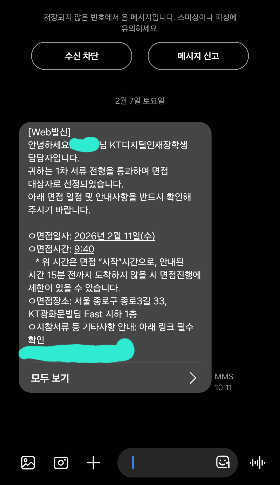
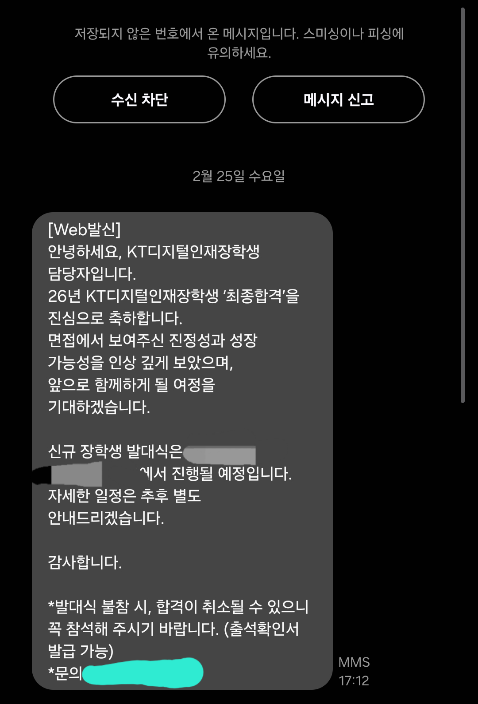

## 지원 과정

4점대 학점을 들고도 교외장학금을 받지 못한 1, 2학년. 슬슬 돈이 쪼들리는 현재, 3학년에는 꼭 장학금을 받겠다고 결심했다.  
이 장학금의 경쟁률이 높을 것으로 에상되고 무엇보다 저장도 안 되는 주제에 페이지 수는 더럽게 많은 웹 구조가 마음에 들지 않아서 지원하지 말까 생각도 했었지만, 붙으면 뭐 좋으니 넣었다. 
가난한 10분위는 아무리 성적이 좋아도 받을 수 있는 장학금이 거의 없는 사실이 너무 슬프다.

### 1차 - 서류 심사

아무리 웹소설과 보고서 짬으로 단련한 필력이라지만, 나의 필력이 객관적으로 부족하다는 것은 사실이다. 그냥 인적사항만 입력한 뒤 젬쌤의 도움을 받아 draft를 먼저 작성했다. 이후 사실과 다르거나 어색한 부분을 수정하고 내용을 추가하여 글을 완성하였다. 

1. **AI·디지털 기술 기반 프로젝트 경험**(해당시 기입, 최대 3개)

    그냥 지금까지 진행한 프로젝트가 별로 없어서 있는 거 싹싹 긁어모아 다 적었다.

2. **AI 또는 데이터·디지털 기술을 학습하게 된 계기와, 해당 기술을 이해하기 위해 어떤 노력을 해왔는지 작성해 주세요.** (700자 이내)

    학벌팔이, 백준/코포 티어팔이, AI그림만졌다도르, 웹개발했다도르 정도 나열하니 금방 700자가 찼다.

3. **AI 또는 디지털 기술과 관련된 프로젝트, 과제, 연구, 공모전, 팀 활동 중 가장 의미 있었던 경험 한 가지를 선택하여 작성해 주세요.** (1000자 이내)

    해커톤 수상했고 이 아이템으로 창업한 이야기를 잘 썼다. 물론 전문가의 도움을 받았다.

4. **본 장학프로그램을 통해 어떤 역량을 더 성장시키고 싶으며, 해당 경험이 향후 본인의 진로 및 사회적 가치창출에 어떻게 연결될 수 있다고 생각하는지 작성해 주세요.** (700자 이내)

    흔한 자소서용 포장멘트를 썼다.  
    기술의 혜택을 누리는 세상 만들겠다~ 실용적인 서비스를 지속적으로 개발하여 배포하겠다~
    

### 2차 - 3:3 면접

면접 4일 전에 서류 합격 발표가 났지만, 면접 전날까지 해커톤을 진행하였기에 많은 준비를 하지 못했다. 추천서도 급하게 요청드려 전날에 겨우 메일로 받았고, 밤에도 웹 페이지 형식의 포트폴리오를 QR로 변환하는 등 서류를 준비하다 02시 30분쯤에 쓰러졌다.  
오전 06시 59분, 3개 중 2번째 아침 알람을 듣고 일어나 가볍게 샤워, 바로 노트북과 씹덕 클리어파일 하나만 들고 서류 출력을 위해 학생회관 동아리방으로 출발하였다.

동아리방 프린터로 출력을 마친 시간은 08시 10분. 예상 도착 시간은 도착해야 할 시간보다 10분 늦은 시각. 급하게 길을 뛰어 내려가 버스를 잡았고, 2호선 - 5호선을 타고 광화문 사옥까지 이동하였다.  
면접을 보러 가는 길에 예상 질문을 준비하려고 했으나, 모션데스크 설치 시각이 오전 10시로 잡혔고 설치 기사님과 연락하느라 도착할 때까지 전혀 준비하지 못했다. 

그렇게 면접을 15분 앞둔 09시 25분에 겨우 도착. 후드티에 운동복을 입은 나와 다르게 다들 정장에다가 메이크업까지 하고 와 내가 여기에 있는 게 맞나 하는 생각도 들었다.  

그러나 내가 누구? *"BlayBus 해커톤 우수상 수상자"* 
어 형은 개발자 패션이야~

명찰을 받아들자마자 바로 대기실로 불렸고, 준비할 시간은 전혀 주어지지 않았다. 직전에 장학생 출신 안내위원분들과 프리토킹을 했는데, 오히려 나 말고 나머지 두 면접자가 잔뜩 긴장해 있어서 즐기자는 마인드로 들어갔다. 교복, 정장, 후드티 let's go.

면접에서는 짧은 자기소개 후 바로 실무와 관련된 질문을 던졌다. 모든 질문을 기억하지는 못하지만, 가장 어려웠던 문제 해결 과정을 물었던 게 기억에 남았다.  
면접 전날까지 진행한 해커톤 썰과, 8개 동아리 운영 썰을 푸니 어렵지 않게 대답할 수 있었다. 

혹시 이 글을 보고 면접을 준비하는 지원자가 있을까 싶어서 남기는 말이지만, 어차피 밑천이 다 털리니 긴장만 하지 말고 솔직하게 잘 대답하는 게 좋은 것 같다. 나는 아니지만 옆옆 지원자는 털렸다.

### 면접이 끝난 뒤

면접이 끝나고 난 뒤 붙을 확률을 6~70% 정도로 예상하였다. 미안할 수도 있는 얘기지만 같이 들어간 다른 두 친구보다는 솔직히 잘 본 거 같았다. 
음료 쿠폰과 캔커피, 수제 빼빼로를 주었다. 커피값쌀먹 ㄹㅇ굿 
직후에 본가에서 여동생과 수학 과외를 할 예정이었기에 조공으로 바치니 좋아했다. 
모션데스크 설치에 문제가 생겨 설치 기사님과 연락했다. 아침에 급하게 나가느라 짐들을 벽까지 밀어놓고 나왔는데 두 눈으로 처참한 상태를 목격하셨을 기사님께 명복을 빈다.

## 합격

이게 되네. 

면접을 보고 난 뒤에 들은 생각이지만, 3인 1조의 면접 구조에서 3:1 정도의 경쟁률이라고 추정했고,
이는 즉 다른 두 지원자보다 내가 높은 점수를 받아야 하는 것을 의미했다. 
무엇보다 내 옆 자리의 지원자가 면접을 잘 봤기에 이 사람을 제치고 나를 뽑아야 할 이유를 잘 모르겠다고 느꼈다. 
잠수하는 팀원과 이를 해결한 썰을 풀은 것이 실무 역량 평가에서 다행히도 높은 점수를 받지 않았을까 하는 생각이 든다. 

다른 분의 티스토리 블로그에서 합격 수기를 읽었는데, 이분은 진짜 전문가셔서 나 말고 다른 분이 합격했어야 하는 것 아닌가라는 생각이 들 만큼 너무 감사한 장학금 선발이었다. 
부모님의 300만원, 지켜냈습니다. 가족톡에만 합격 사실을 알렸는데 어느새 온 친척까지 소식을 다 듣고 축하한다는 연락이 쏟아지고 있다. 

성현이, 우준이, 지훈사마가 아니었다면 장학금에 합격할 수 없었다. 진짜 너무 고마운 동료들이다.

그나저나 랩인턴하고 발대식 겹치는데 어떡하지