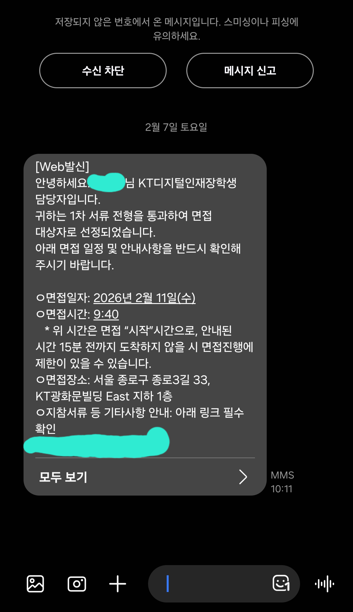
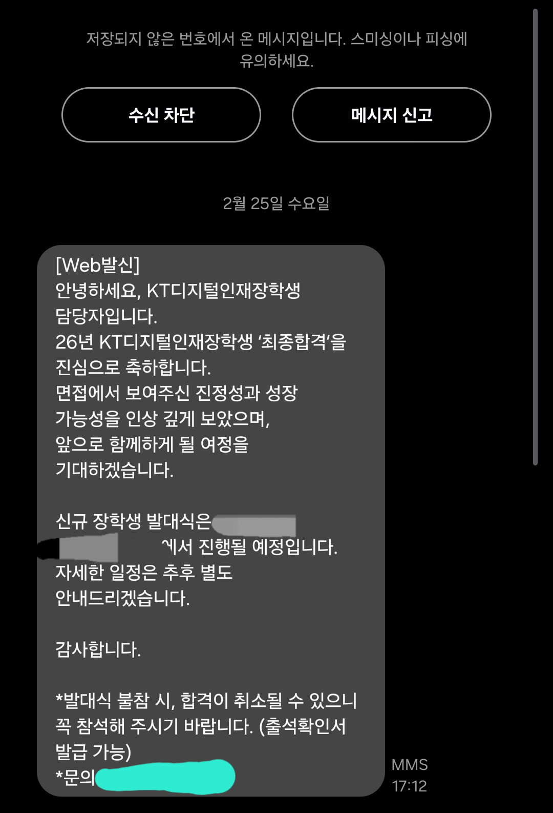

## 글을 쓰며

이 글은 2026년 KT디지털인재장학금에 지원하며 어떤 경험을 서류에 담았고, 준비 시간이 부족했던 면접에서 무엇을 근거로 답했는지 남긴 기록이다. 결과를 먼저 요약하기보다 지원 당시의 판단과 실제 진행 순서를 따라가려 한다.

## 지원 배경과 계획

1·2학년 동안 4점대 학점을 유지했지만 교외 장학금에는 선발되지 못했다. 3학년부터 자취를 시작하면서 등록금과 생활비 부담이 커졌고, 학업과 연구에 쓸 시간을 지키기 위해서는 장학금이 필요했다. 소득 구간상 지원할 수 있는 장학금이 많지 않았기 때문에, 2026년에는 지원 가능한 기회를 놓치지 않기로 했다.

KT디지털인재장학금은 그 과정에서 지원한 장학금이었다. 지원 페이지가 사용하기 불편했고 작성 분량도 적지 않아 망설였지만, AI·소프트웨어 프로젝트와 연구 경험을 종합적으로 평가한다는 점에서 내 활동을 설명하기에 적합하다고 판단했다.

지원 당시부터 장학금에 관한 장기 계획은 분명했다. **KT디지털인재장학금은 처음부터 2026년 1학기 한 학기만 수혜하고, 대통령과학장학금에 선발되면 이후에는 그 장학금으로 전환할 계획이었다.** 두 장학금을 동시에 유지하려는 계획이 아니라, 당장의 등록금 부담을 해결하면서 더 장기적인 연구·학업 지원 기회에도 계속 도전하려는 단계적 선택이었다. 그렇다고 KT 장학 프로그램을 가볍게 생각한 것은 아니었다. 선발된다면 수혜 기간 동안 요구되는 활동에 성실히 참여하고, 내가 가진 개발 역량을 실제 결과로 보여주고자 했다.

## 1차 서류 심사

먼저 인적 사항과 활동 증빙을 정리한 뒤, 자기소개서 초안 작성 과정에서 젬쌤의 도움을 받았다. 초안을 그대로 사용하지 않고 사실관계와 표현을 다시 검토하고, 빠진 경험과 구체적인 역할을 보완해 최종 문서를 완성했다.

### AI·디지털 기술 기반 프로젝트 경험

최대 세 개의 경험을 적을 수 있었다.

- 동아리 구성원들과 서울대학교 시간표 서비스를 개발한 경험
- 해커톤에서 수상한 뒤 해당 아이템의 사업화를 시도한 경험
- MLSYS Lab에서 Diffusion Model과 GPU 시스템을 연구한 경험

단순히 프로젝트 이름을 나열하기보다 각 경험에서 맡은 역할, 해결한 문제와 결과를 구분해 작성했다.

### AI·디지털 기술을 학습한 계기와 노력

세종과학예술영재학교와 서울대학교에서의 학업, 알고리즘 문제 해결, Stable Diffusion 개인 연구, 웹 서비스 개발 경험을 하나의 흐름으로 연결했다. 여러 분야를 경험했다는 사실보다 관심을 실제 학습과 결과물로 이어 왔다는 점을 보여주는 데 집중했다.

### 가장 의미 있었던 프로젝트 경험

해커톤 수상과 후속 사업화 경험을 선택했다. 제한된 시간 안에 아이디어를 제품 형태로 구현하고, 팀의 역할을 조정하며, 결과 이후에도 프로젝트를 이어 간 과정을 중심으로 작성했다. 이 문항 역시 경험을 정리하고 표현하는 과정에서 전문가의 도움을 받았다.

### 성장 목표와 사회적 가치

AI와 소프트웨어를 연구에만 머물게 하지 않고 실제 사용자가 이용할 수 있는 서비스로 구현하고 싶다는 목표를 적었다. 장학 프로그램을 통해 기술적 완성도와 제품 개발 역량을 높이고, 지속적으로 서비스를 개발·배포하겠다는 계획을 제시했다. 자기소개서의 형식에 맞게 정리했지만, 그 방향 자체는 당시에도 지금도 진심이다.

## 2차 3:3 면접

서류 합격 발표는 면접 4일 전에 나왔다. 그러나 면접 전날까지 해커톤에 참여하고 있어 충분한 준비 시간을 확보하지 못했다. 추천서도 촉박하게 부탁드려 전날에야 받을 수 있었고, 웹 포트폴리오와 QR 링크, 출력 자료를 정리하다 오전 2시 30분경 잠들었다.

면접 당일 오전에는 학생회관 동아리방에서 서류를 출력한 뒤 광화문 사옥으로 이동했다. 일정이 빠듯해 이동 중 예상 질문을 정리하려 했지만, 다른 일정과 연락이 겹쳐 실질적인 준비는 거의 하지 못했다. 면접 시작 15분 전인 오전 9시 25분에 도착했다.

다른 지원자들은 대부분 정장 차림이었고 나는 후드티와 운동복 차림이었다. 준비 상태와 복장만 놓고 보면 위축될 수 있는 상황이었지만, 전날까지 실제 개발 현장에서 해커톤을 진행했다는 사실에 집중했다. 형식적인 인상보다 지금까지 해 온 프로젝트와 문제 해결 경험을 정확히 설명하는 것이 중요하다고 판단했다.

면접은 지원자 3명과 면접관 3명이 함께 참여하는 방식이었다. 짧은 자기소개 후 실무 경험을 확인하는 질문이 이어졌다. 모든 질문을 기억하지는 못하지만, 가장 어려웠던 문제와 그것을 해결한 과정을 묻는 질문이 특히 기억에 남는다.

나는 직전 해커톤에서 팀 운영상 문제가 발생했을 때 대응한 경험과, 여러 동아리의 운영진으로 활동하며 갈등과 업무 공백을 해결한 경험을 답변에 활용했다. 미리 만든 모범 답안을 재현하기보다 실제로 겪은 상황을 문제–판단–행동–결과의 순서로 설명했다. 준비 시간이 부족했음에도 면접을 안정적으로 마칠 수 있었던 이유는 말하기 기술보다 설명할 수 있는 실제 경험이 충분했기 때문이라고 생각한다.

면접을 준비하는 지원자에게 조언한다면, 예상 질문의 답을 외우는 것보다 자신의 프로젝트에서 어떤 판단을 내렸고 그 결과가 무엇이었는지를 정리하는 편이 효과적이다. 면접에서는 경험의 세부 사항까지 질문하기 때문에 과장된 서사보다 솔직하고 구조적인 답변이 오래 버틴다.

### 면접 이후의 판단

면접 직후에는 합격 가능성을 약 60~70%로 예상했다. 답변 자체는 안정적이었다고 생각했지만, 함께 면접을 본 지원자들도 각자의 강점과 전문성을 갖고 있었다. 특히 다른 지원자가 좋은 답변을 하는 모습을 보며 최종 선발을 확신할 수는 없었다.

돌이켜 보면 팀원이 역할을 수행하지 못한 상황에서 업무를 재배치하고 프로젝트를 완성한 경험이 실무 역량 평가에서 긍정적으로 작용했을 가능성이 크다. 기술 지식뿐 아니라 예기치 않은 문제를 발견하고 끝까지 결과를 만들어 낸 경험을 구체적으로 설명한 것이 내 답변의 강점이었다.

## 결과

최종 합격 통보를 받았을 때는 기쁨과 안도감이 컸다. 경쟁률을 정확히 알 수는 없었지만, 면접 구조와 지원자 수를 고려하면 같은 조의 지원자들보다 분명한 선발 근거를 보여주어야 했다. 충분히 준비하지 못한 상황에서도 실제 프로젝트와 조직 운영 경험을 구체적인 사례로 전달한 점이 결과로 이어졌다고 본다.

이 합격으로 한 학기 등록금 300만 원의 부담을 덜 수 있었다. 합격 사실을 가족에게 알린 뒤 친척들에게까지 소식이 전해졌고 많은 축하를 받았다. 경제적인 지원뿐 아니라 지금까지 쌓아 온 개발·연구 경험을 외부 기관에서 인정받았다는 점에서도 의미가 있었다.

다만 합격 이후에도 처음 세운 계획은 달라지지 않았다. KT디지털인재장학금은 2026년 1학기의 기반으로 삼고, 대통령과학장학금에 선발될 경우 이후 지원 체계를 그쪽으로 전환하고자 했다. KT 장학금 합격은 최종 목표라기보다 학업과 연구를 지속하면서 더 큰 기회에 도전할 수 있게 해 준 중요한 중간 기반이었다.

## 돌아보며

이번 지원 과정에서 확인한 강점은 세 가지였다.

1. 알고리즘, 웹 개발, AI 연구와 해커톤 경험을 하나의 기술 성장 과정으로 연결할 수 있었다.
2. 팀 문제와 조직 운영 경험을 추상적인 리더십이 아니라 실제 행동과 결과로 설명할 수 있었다.
3. 준비가 부족한 상황에서도 경험을 과장하지 않고 핵심을 구조화해 전달할 수 있었다.

반면 추천서, 포트폴리오와 이동 일정을 면접 직전까지 준비한 것은 명백히 개선해야 할 부분이다. 결과가 좋았다는 이유로 준비 과정까지 합리화할 수는 없다. 다음 지원에서는 서류 제출 단계부터 증빙자료와 예상 질문을 정리하고, 면접 전날에는 내용 검토에만 집중할 수 있도록 일정을 확보해야 한다.

서류와 면접 준비를 도와준 성현이, 우준이와 지훈 선배가 없었다면 합격하기 어려웠을 것이다. 도움을 준 사람들에게 다시 한번 감사를 전한다. 이번 합격은 개인의 경험이 외부 평가에서도 경쟁력을 가질 수 있다는 확인이었고, 동시에 그 경험을 더 정확하고 책임감 있게 전달해야 한다는 과제를 남겼다.
