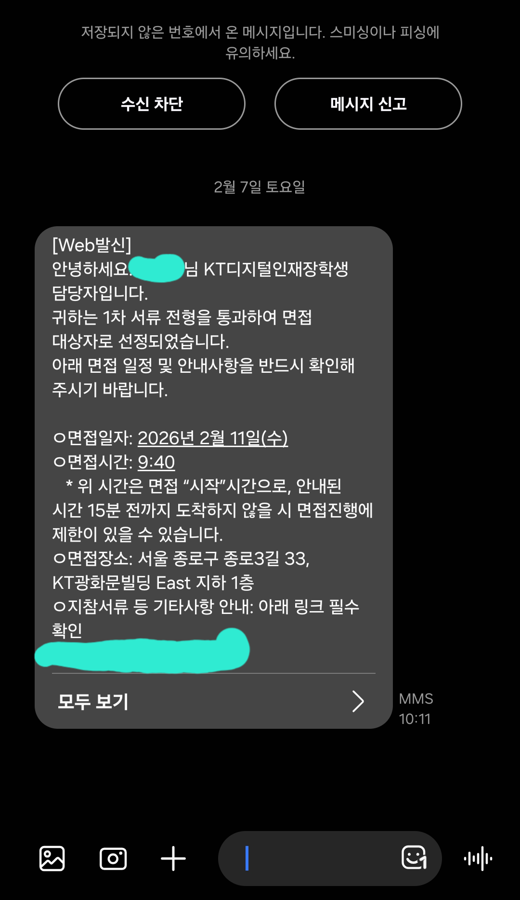
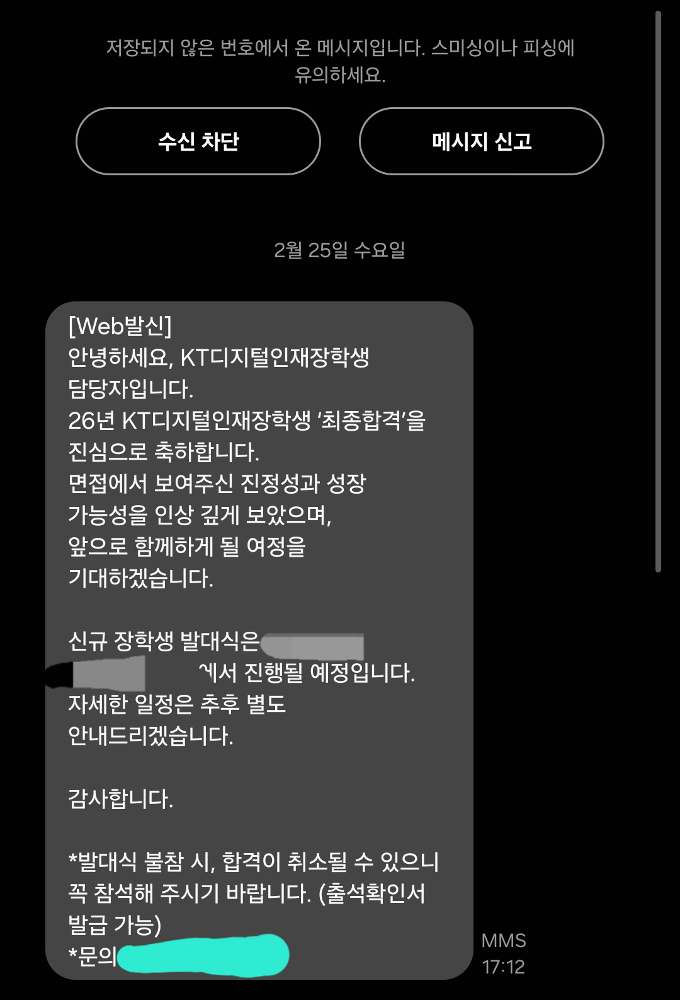

## 글을 쓰며

2026년 KT디지털인재장학금에 지원하면서 서류에 어떤 경험을 썼고, 준비할 시간이 거의 없던 면접에서 뭘 근거로 답했는지 적어 둔다. 결과보다는 그때 했던 판단과 진행 순서대로 써 보려고 한다.

## 지원 배경과 계획

1·2학년 동안 4점대 학점을 유지했는데도 교외 장학금에는 한 번도 붙지 못했다. 3학년부터 자취를 시작하니 등록금과 생활비가 꽤 부담이 됐고, 학업이랑 연구에 쓸 시간을 지키려면 장학금이 필요했다. 소득 구간 때문에 지원할 수 있는 장학금도 많지 않아서, 2026년에는 지원할 수 있는 건 다 지원하기로 했다.

KT디지털인재장학금도 그렇게 지원한 장학금 중 하나다. 지원 페이지가 쓰기 불편했고 써야 할 분량도 적지 않아서 좀 망설였다. 그래도 AI·소프트웨어 프로젝트와 연구 경험을 종합적으로 본다고 해서, 내가 해 온 활동을 설명하기엔 잘 맞겠다 싶었다.

장학금 계획은 지원할 때부터 정해 두었다. **KT디지털인재장학금은 처음부터 2026년 1학기 한 학기만 받고, 대통령과학장학금에 선발되면 그 뒤로는 그쪽으로 옮길 생각이었다.** 두 장학금을 같이 받으려던 건 아니고, 당장 등록금 문제를 해결하면서 더 긴 연구·학업 지원에도 계속 도전해 보려는 계획이었다. 그렇다고 KT 장학 프로그램을 가볍게 본 건 아니다. 붙으면 수혜 기간 동안 해야 하는 활동에 성실히 참여하고, 개발 실력도 결과물로 보여 주고 싶었다.

## 1차 서류 심사

인적 사항과 활동 증빙부터 챙기고, 자기소개서 초안은 젬쌤의 도움을 받아 썼다. 초안을 그대로 쓰지는 않았고, 사실관계와 표현을 다시 보면서 빠진 경험과 내가 맡은 역할을 채워 넣어 최종본을 만들었다.

### AI·디지털 기술 기반 프로젝트 경험

경험은 최대 세 개까지 쓸 수 있었다.

- 동아리 구성원들과 서울대학교 시간표 서비스를 개발한 경험
- 해커톤에서 수상한 뒤 해당 아이템의 사업화를 시도한 경험
- MLSYS Lab에서 Diffusion Model과 GPU 시스템을 연구한 경험

프로젝트 이름만 늘어놓지 않고, 경험마다 내가 맡은 역할과 해결한 문제, 결과를 나눠서 썼다.

### AI·디지털 기술을 학습한 계기와 노력

세종과학예술영재학교와 서울대학교에서의 공부, 알고리즘 문제 풀이, Stable Diffusion 개인 연구, 웹 서비스 개발 경험을 하나로 이어서 썼다. 이것저것 해 봤다는 것보다, 관심이 생기면 실제로 공부하고 뭔가 만들어 냈다는 걸 보여 주려고 했다.

### 가장 의미 있었던 프로젝트 경험

해커톤 수상과 그 뒤의 사업화 경험을 골랐다. 짧은 시간 안에 아이디어를 제품 형태로 만들고, 팀 역할을 조정하고, 대회가 끝난 뒤에도 프로젝트를 이어 간 과정을 위주로 썼다. 이 문항도 경험을 정리하고 표현하는 데 전문가의 도움을 받았다.

### 성장 목표와 사회적 가치

AI와 소프트웨어를 연구에서 끝내지 않고 실제 사용자가 쓰는 서비스로 만들고 싶다고 썼다. 장학 프로그램에서 기술적 완성도와 제품 개발 역량을 키우고, 서비스를 꾸준히 개발·배포하겠다는 계획도 적었다. 자기소개서 형식에 맞춰 다듬긴 했지만, 그 방향은 그때도 지금도 진심이다.

## 2차 3:3 면접

서류 합격 발표는 면접 4일 전에 났다. 그런데 면접 전날까지 해커톤에 나가 있어서 준비할 시간이 거의 없었다. 추천서도 급하게 부탁드려서 전날에야 받았고, 웹 포트폴리오와 QR 링크, 출력할 자료를 정리하다가 새벽 2시 30분쯤 잠들었다.

면접 당일 아침에는 학생회관 동아리방에서 서류를 뽑아서 광화문 사옥으로 갔다. 가는 길에 예상 질문이라도 정리하려 했는데, 다른 일정이랑 연락이 겹쳐서 사실상 준비는 거의 못 했다. 도착하니 오전 9시 25분, 면접 15분 전이었다.

다른 지원자들은 대부분 정장을 입고 왔고 나는 후드티에 운동복 차림이었다. 준비도 복장도 밀리니 위축될 만했지만, 전날까지 해커톤 현장에서 실제로 개발하다 왔다는 데 집중하기로 했다. 겉모습보다는 지금까지 한 프로젝트와 문제를 해결한 경험을 정확하게 설명하는 게 더 중요하다고 생각했다.

면접은 지원자 3명, 면접관 3명이 같이 들어가는 방식이었다. 짧게 자기소개를 하고 나서 실무 경험을 확인하는 질문이 이어졌다. 질문을 다 기억하지는 못하는데, 가장 어려웠던 문제와 그걸 어떻게 해결했는지 묻는 질문이 특히 기억에 남는다.

나는 직전 해커톤에서 팀 운영에 문제가 생겼을 때 대응한 경험과, 여러 동아리 운영진으로 일하면서 갈등과 업무 공백을 수습한 경험으로 답했다. 미리 만든 답을 외워서 말하기보다 실제로 겪은 상황을 문제–판단–행동–결과 순서로 풀어서 설명했다. 준비가 부족했는데도 면접을 무난히 마칠 수 있었던 건, 말을 잘해서라기보다 설명할 실제 경험이 충분했기 때문인 것 같다.

면접을 준비하는 사람에게 하나 말하자면, 예상 질문 답을 외우는 것보다 자기 프로젝트에서 어떤 판단을 했고 결과가 어땠는지 정리해 두는 게 더 도움이 된다. 면접관들이 경험을 꽤 세세하게 물어보기 때문에, 부풀린 이야기보다는 솔직하고 차근차근 하는 답이 끝까지 버틴다.

### 면접 이후의 판단

면접 직후에는 붙을 확률을 60~70% 정도로 봤다. 답변은 무난했다고 생각했지만, 같이 면접 본 지원자들도 저마다 강점과 전문성이 있었다. 특히 다른 지원자가 좋은 답변을 하는 걸 보면서 합격을 확신하긴 어려웠다.

돌이켜 보면 팀원이 역할을 못 하는 상황에서 업무를 다시 나누고 프로젝트를 끝까지 완성한 경험이 실무 역량 평가에서 좋게 작용했을 것 같다. 기술 지식만이 아니라, 예상하지 못한 문제를 발견하고 끝까지 결과를 만들어 낸 경험을 구체적으로 이야기한 게 내 답변의 강점이었다고 생각한다.

## 결과

최종 합격 통보를 받았을 때는 기쁘기도 했고 무엇보다 안도가 됐다. 경쟁률은 정확히 몰랐지만, 면접 구조와 지원자 수를 생각하면 같은 조 지원자들보다 뽑을 이유를 분명히 보여 줘야 했다. 준비를 제대로 못 한 상태에서도 실제 프로젝트와 조직 운영 경험을 구체적인 사례로 전달한 게 통했다고 본다.

덕분에 한 학기 등록금 300만 원 부담을 덜었다. 가족에게 합격 소식을 알렸더니 친척들한테까지 소식이 퍼져서 축하를 많이 받았다. 돈 문제도 컸지만, 지금까지 해 온 개발·연구 경험을 외부 기관에서 인정받았다는 것도 의미가 있었다.

합격하고 나서도 처음 세운 계획은 그대로였다. KT디지털인재장학금으로 2026년 1학기를 버티고, 대통령과학장학금에 선발되면 그 뒤로는 그쪽으로 옮길 생각이었다. KT 장학금은 최종 목표라기보다, 학업과 연구를 계속하면서 더 큰 기회에 도전할 수 있게 해 준 중요한 발판이었다.

## 돌아보며

이번에 지원하면서 알게 된 내 강점은 세 가지 정도다.

1. 알고리즘, 웹 개발, AI 연구와 해커톤 경험을 하나의 기술 성장 과정으로 이어서 설명할 수 있었다.
2. 팀 문제와 조직 운영 경험을 막연한 리더십이 아니라 실제로 한 행동과 결과로 설명할 수 있었다.
3. 준비가 부족한 상황에서도 경험을 부풀리지 않고 요점만 정리해서 전달할 수 있었다.

반대로 추천서, 포트폴리오, 이동 일정까지 면접 직전에 챙긴 건 확실히 고쳐야 한다. 결과가 좋았다고 해서 준비 과정까지 괜찮았던 건 아니다. 다음에 지원할 때는 서류 낼 때부터 증빙자료와 예상 질문을 정리해 두고, 면접 전날에는 내용 검토만 할 수 있게 일정을 비워 둬야겠다.

서류와 면접 준비를 도와준 성현이, 우준이, 지훈 선배가 없었다면 붙기 어려웠을 거다. 도와준 사람들에게 다시 한번 고맙다는 말을 전한다. 내 경험이 바깥에서도 통한다는 걸 확인했고, 동시에 그 경험을 더 정확하고 책임감 있게 전달해야겠다는 숙제도 생겼다.
